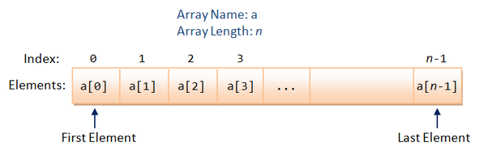

# Building a SuperArray Class


### Background:
* In class we have used the built-in [Arrays class](https://docs.oracle.com/javase/7/docs/api/java/util/Arrays.html) and have worked with data, such as test scores. We have instantiated arrays, assigned values to the array, and traversed the array to sort, search for specific values, or perform calculations.
* In reflecting on our work, we have come to the conclusion that the Arrays class has some limitations that make our work a bit tougher. <br/>Some limitations include:
  * Its size is determined when the array is instantiated and cannot be changed later on.
  * Cannot easily add or remove values from the array.
  * Every element must be of the same type.

*Our goal is to create our own data structure that will alleviate some of these issues.*

### Requirements:
* Create a directory `00-SuperArray` that contains the files `SuperArray.java` and `Driver.java`
* In the Driver file, make sure you instantiate various SuperArray objects and make sure you show that the following methods work as intended.
* In `SuperArray.java` have the following:
  * Instance variables
  * A constructor that takes in a specific size.
  * A constructor that is not parameterized that sets the size of the array to 10 by default.
  * An add method, `public void add(int val)` that appends the value to the array. Make sure you consider the various cases involved here (an array that has room vs. filled-up).
  * Another add method, `public void add(int index, int val)` that inserts a value to a specific index in the array.
  * A grow method, `public void grow(int n)` that enlarges the array by a specific amount.
  * A set method, `public void set(int i, int val)` that sets the value of a specific index of the array.
  * An is-empty method, `public boolean isEmpty()` that returns whether or not the array is empty.
  * A remove method, `public void remove(int index)` that removes the value at a specific index of the array and shifts all of the values to fill-in the gap.
  * A to-string method, `public String toString()` that creates a visual output of the contents of the array.

### Other Notes:
* You may want to use a method like the following to help you debug along the way:
```
public String debug(){
  String s = "";
  s = "Size: " + this.data.length;
  s = s + " LastItem: " + lastItem + "  Data: ";
  for (int i = 0; i < lastItem; i++) {
    s = s + data[i] + ", ";
  }
  s = s + "\n";
  return s;
}
```
* Be sure to include comments throughout your code; NPIR method labels as well as in-line comments where necessary.
